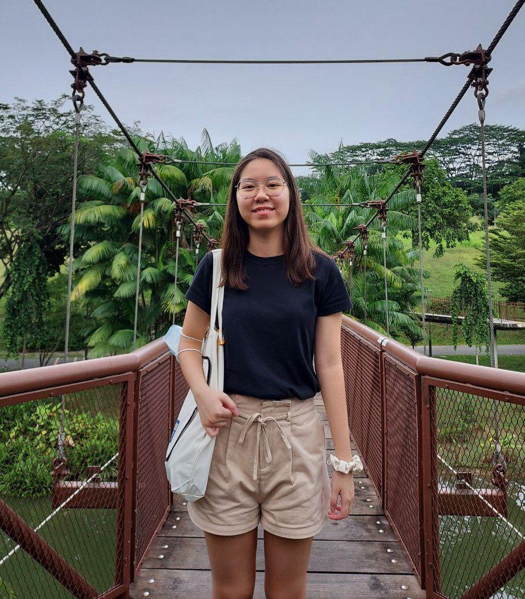
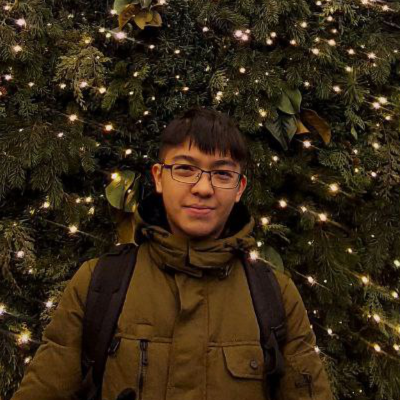
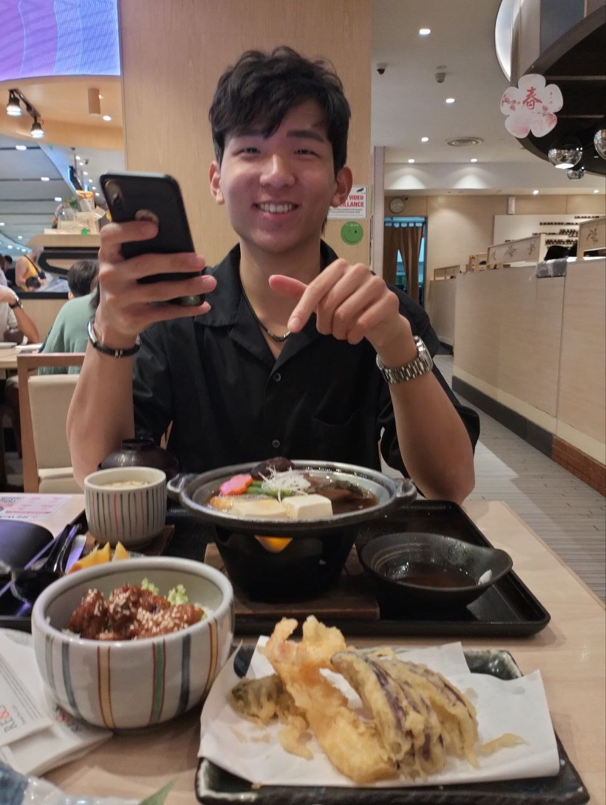

We are a team based in the [School of Computing, National University of Singapore](http://www.comp.nus.edu.sg).

You can reach us at the email `seer[at]comp.nus.edu.sg`

## Project team

### Goh Li Ting

[[github](https://github.com/Goh-Li-Ting)]
[[portfolio](team/johndoe.md)]

* Role: Project Advisor

### Leong Yuan Kun

[[github](https://github.com/aexolate)]
[[portfolio](team/johndoe.md)]

* Role: Team Lead
* Responsibilities: UI

### Huang Wei'En

[[github](https://github.com/Weiennn)] [[portfolio](team/johndoe.md)]

* Role: Developer
* Responsibilities: Data

### Richard Hew

[[github](https://github.com/ricketytoc)]
[[portfolio](team/ricketytoc.md)]

* Role: Developer
* Responsibilities: Dev Ops + Threading

### Chen Kuei

[[github](https://github.com/Chen-Kuei)]
[[portfolio](team/johndoe.md)]

* Role: Developer
* Responsibilities: UI
