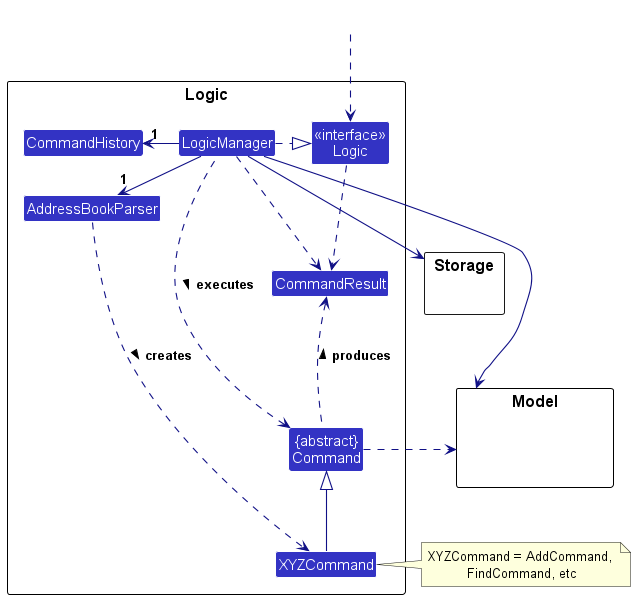
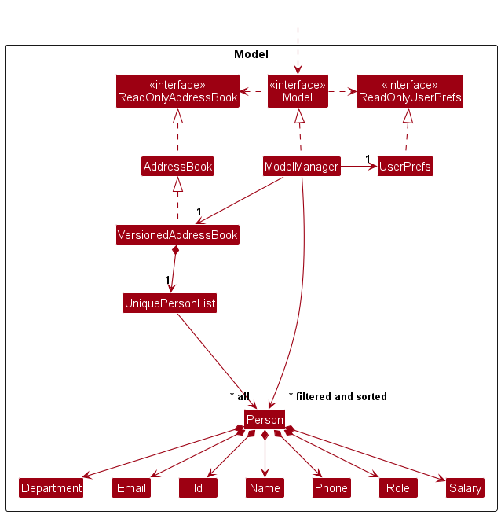
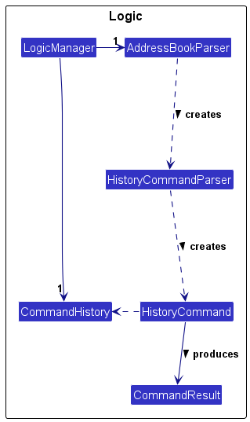
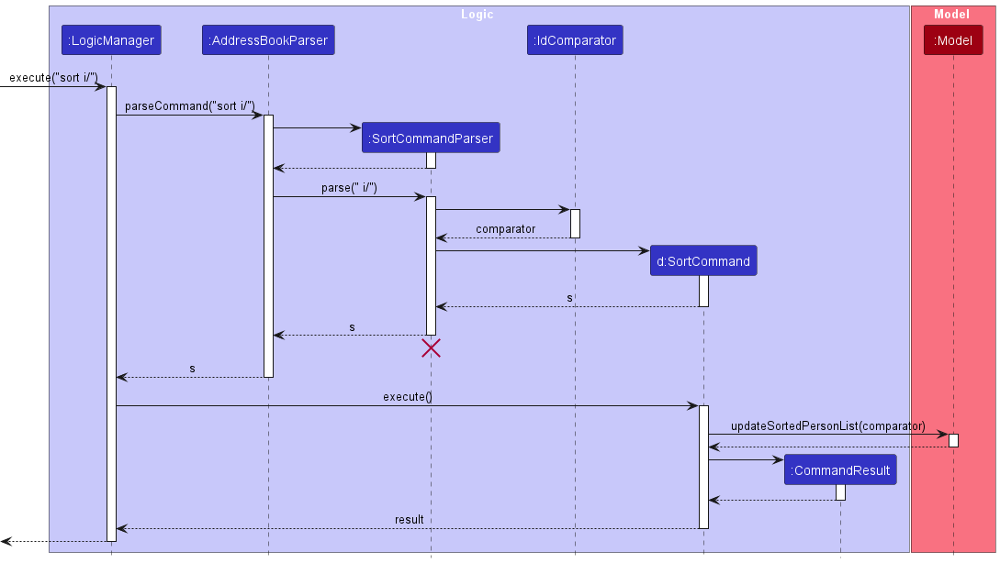
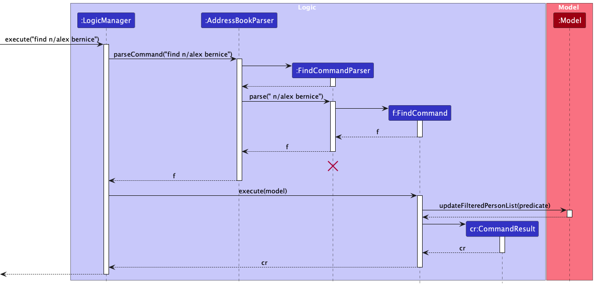
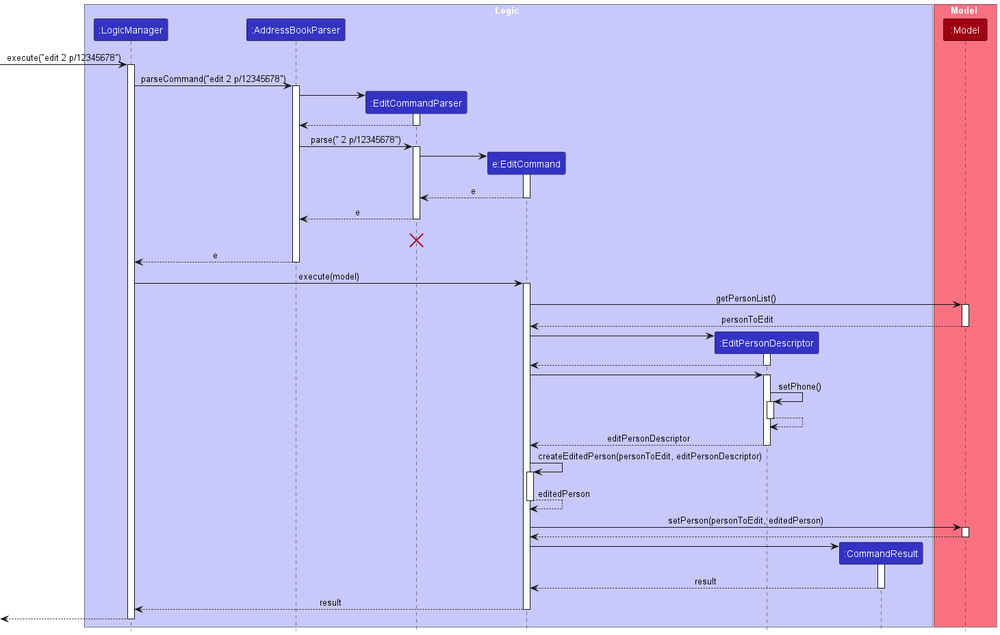
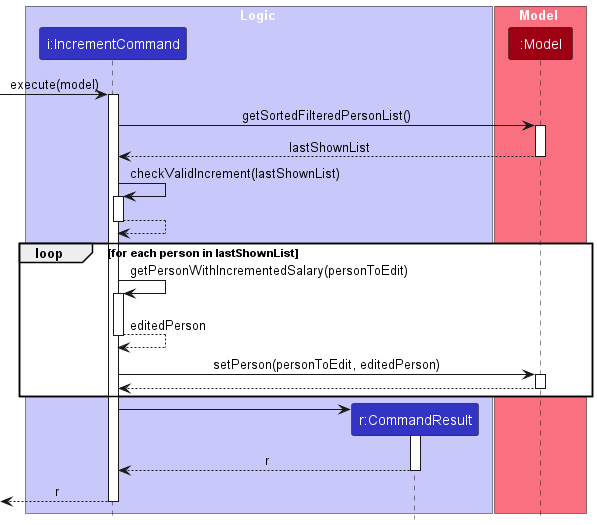
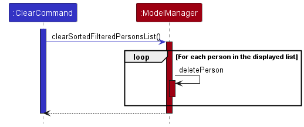

* Table of Contents
{:toc}

--------------------------------------------------------------------------------------------------------------------

## **Acknowledgements**

* {list here sources of all reused/adapted ideas, code, documentation, and third-party libraries -- include links to the original source as well}

--------------------------------------------------------------------------------------------------------------------

## **Setting up, getting started**

Refer to the guide [_Setting up and getting started_](SettingUp.md).

--------------------------------------------------------------------------------------------------------------------

## **Design**

:bulb: **Tip:** The `.puml` files used to create diagrams in this document `docs/diagrams` folder. Refer to the [_PlantUML Tutorial_ at se-edu/guides](https://se-education.org/guides/tutorials/plantUml.html) to learn how to create and edit diagrams.

### Architecture

The ***Architecture Diagram*** given above explains the high-level design of the App.

Given below is a quick overview of main components and how they interact with each other.

**Main components of the architecture**

**`Main`** (consisting of classes [`Main`](https://github.com/se-edu/addressbook-level3/tree/master/src/main/java/seedu/address/Main.java) and [`MainApp`](https://github.com/se-edu/addressbook-level3/tree/master/src/main/java/seedu/address/MainApp.java)) is in charge of the app launch and shut down.
* At app launch, it initializes the other components in the correct sequence, and connects them up with each other.
* At shut down, it shuts down the other components and invokes cleanup methods where necessary.

The bulk of the app's work is done by the following four components:

* [**`UI`**](#ui-component): The UI of the App.
* [**`Logic`**](#logic-component): The command executor.
* [**`Model`**](#model-component): Holds the data of the App in memory.
* [**`Storage`**](#storage-component): Reads data from, and writes data to, the hard disk.

[**`Commons`**](#common-classes) represents a collection of classes used by multiple other components.

**How the architecture components interact with each other**

The *Sequence Diagram* below shows how the components interact with each other for the scenario where the user issues the command `delete 1`.

Each of the four main components (also shown in the diagram above),

* defines its *API* in an `interface` with the same name as the Component.
* implements its functionality using a concrete `{Component Name}Manager` class (which follows the corresponding API `interface` mentioned in the previous point.

For example, the `Logic` component defines its API in the `Logic.java` interface and implements its functionality using the `LogicManager.java` class which follows the `Logic` interface. Other components interact with a given component through its interface rather than the concrete class (reason: to prevent outside component's being coupled to the implementation of a component), as illustrated in the (partial) class diagram below.

The sections below give more details of each component.

### UI component

The **API** of this component is specified in [`Ui.java`](https://github.com/se-edu/addressbook-level3/tree/master/src/main/java/seedu/address/ui/Ui.java)

The UI consists of a `MainWindow` that is made up of parts e.g.`CommandBox`, `ResultDisplay`, `PersonListPanel`, `StatusBarFooter` etc. All these, including the `MainWindow`, inherit from the abstract `UiPart` class which captures the commonalities between classes that represent parts of the visible GUI.

The `UI` component uses the JavaFx UI framework. The layout of these UI parts are defined in matching `.fxml` files that are in the `src/main/resources/view` folder. For example, the layout of the [`MainWindow`](https://github.com/se-edu/addressbook-level3/tree/master/src/main/java/seedu/address/ui/MainWindow.java) is specified in [`MainWindow.fxml`](https://github.com/se-edu/addressbook-level3/tree/master/src/main/resources/view/MainWindow.fxml)

The `UI` component,

* executes user commands using the `Logic` component.
* listens for changes to `Model` data so that the UI can be updated with the modified data.
* keeps a reference to the `Logic` component, because the `UI` relies on the `Logic` to execute commands.
* depends on some classes in the `Model` component, as it displays `Person` object residing in the `Model`.

### Logic component

**API** : [`Logic.java`](https://github.com/se-edu/addressbook-level3/tree/master/src/main/java/seedu/address/logic/Logic.java)

Here's a (partial) class diagram of the `Logic` component:

The sequence diagram below illustrates the interactions within the `Logic` component, taking `execute("delete 1")` API call as an example.

:information_source: **Note:** The lifeline for `DeleteCommandParser` should end at the destroy marker (X) but due to a limitation of PlantUML, the lifeline reaches the end of diagram.

How the `Logic` component works:

1. When `Logic` is called upon to execute a command, it is passed to an `AddressBookParser` object which in turn creates a parser that matches the command (e.g., `DeleteCommandParser`) and uses it to parse the command.
1. This results in a `Command` object (more precisely, an object of one of its subclasses e.g., `DeleteCommand`) which is executed by the `LogicManager`.
1. The command can communicate with the `Model` when it is executed (e.g. to delete a person).
1. The result of the command execution is encapsulated as a `CommandResult` object which is returned back from `Logic`.

Here are the other classes in `Logic` (omitted from the class diagram above) that are used for parsing a user command:

How the parsing works:
* When called upon to parse a user command, the `AddressBookParser` class creates an `XYZCommandParser` (`XYZ` is a placeholder for the specific command name e.g., `AddCommandParser`) which uses the other classes shown above to parse the user command and create a `XYZCommand` object (e.g., `AddCommand`) which the `AddressBookParser` returns back as a `Command` object.
* All `XYZCommandParser` classes (e.g., `AddCommandParser`, `DeleteCommandParser`, ...) inherit from the `Parser` interface so that they can be treated similarly where possible e.g, during testing.

### Model component
**API** : [`Model.java`](https://github.com/se-edu/addressbook-level3/tree/master/src/main/java/seedu/address/model/Model.java)

The `Model` component,

* stores the address book data i.e., all `Person` objects (which are contained in a `UniquePersonList` object).
* stores the currently 'selected' `Person` objects (e.g., results of a search query) as a separate _filtered_ list which is exposed to outsiders as an unmodifiable `ObservableList<Person>` that can be 'observed' e.g. the UI can be bound to this list so that the UI automatically updates when the data in the list change.
* stores a `UserPref` object that represents the user’s preferences. This is exposed to the outside as a `ReadOnlyUserPref` objects.
* does not depend on any of the other three components (as the `Model` represents data entities of the domain, they should make sense on their own without depending on other components)

:information_source: **Note:** An alternative (arguably, a more OOP) model is given below. It has a `Tag` list in the `AddressBook`, which `Person` references. This allows `AddressBook` to only require one `Tag` object per unique tag, instead of each `Person` needing their own `Tag` objects. 

### Storage component

**API** : [`Storage.java`](https://github.com/se-edu/addressbook-level3/tree/master/src/main/java/seedu/address/storage/Storage.java)

The `Storage` component,
* can save both address book data and user preference data in JSON format, and read them back into corresponding objects.
* inherits from both `AddressBookStorage` and `UserPrefStorage`, which means it can be treated as either one (if only the functionality of only one is needed).
* depends on some classes in the `Model` component (because the `Storage` component's job is to save/retrieve objects that belong to the `Model`)

### Common classes

Classes used by multiple components are in the `seedu.addressbook.commons` package.

--------------------------------------------------------------------------------------------------------------------

## **Implementation**

This section describes some noteworthy details on how certain features are implemented.

### History feature
The `history` feature allows users to access past valid commands that they made. This feature is supported by 
three classes, `CommandHistory`, `HistoryCommandParser` and `HistoryCommand`. 

#### Implementation

`CommandHistory`: This class is responsible for storing the history of valid commands that the user has entered.  
`HistoryCommandParser`: Parses the user input to create an appropriate HistoryCommand object.  
`HistoryCommand`: Executes the history command.  

After a successful user command has been executed `CommandHistory#add(input)` will be called to store the successful 
user input in the `CommandHistory`. When a user inputs a inputs a history command with the appropriate argument, the 
`AddressBookParser` will be called to produce the `HistoryCommandParser` to properly parse the input. A 
`HistoryCommand` object will be created. When the `Command#execute(model, commandHistory)` is called on the 
`HistoryCommand`, the `HistoryCommand` will call `CommandHistory#getUserCommandHistory()` to get the list of
valid user commands. `HistoryCommand` will then return a string of the appropriate number of user command that the
user has specified.

#### Design Considerations

**Aspect: Which component should we choose to store CommandHistory:**

* **Alternative 1 (current choice):** Store it under `Logic`.  
**Why:** The Logic component is responsible for command execution and parsing. 
Adding a history feature here would allow you to easily keep track of commands as they are executed.

* **Alternative 2:** Store it under `Model`.  
**Why:** The `Model` component is responsible for maintaining the state of the application. If we consider
the command history part of the application's state, it might make more sense to put it here.

**Decision:** Since the command history is only active for the duration of the application and does not need
to be saved, placing it in the `logic` component is more appropriate. If the command history need to persist
across sessions, it might be better to place it in the `model` component, as this layer is generally responsible
for data to be saved.

### Sort feature

#### Implementation

The sort command is facilitated by `ModelManager`. `ModelManager` contains a `SortedList<Person>` and 
`FilteredList<Person>` to provide sorting and filtering on the same list. The original list is fetched from 
`AddressBook#getPersonList()` and passed to the `FilteredList`. The `FilteredList` is then passed to the `SortedList`.
By returning the `SortedList` as an `ObservableList<Person>`, the UI will be able to update the person cards displayed
after the `find` or `sort` command has been used.

To facilitate comparing between two `Person` objects, the attributes also implement `Comparable<Person>`. The
comparators for the attributes can be used to then compare two Person on a specific attribute.

The command only allows for the sorting to be performed on one of the Person's attribute. The `SortCommandParser` will
extract the attribute, and create a `SortCommand` using the corresponding comparator for that attribute. The sequence 
diagram below illustrates how the comparator is obtained and passed to the Model to be executed.

:information_source: **Note:** The lifeline for `SortCommandParser` should
end at the destroy marker (X) but due to a limitation of PlantUML, the lifeline reaches the end of diagram.

  
### Find Feature

#### Implementation

The Find feature is facilitated by the following operations:
* `Model#updateFilteredPersonList()` — Updates the filtered person list based on the Predicate<Person> given to the FindCommand object.

Given below is an example usage scenario and how the find mechanism behaves at each step.

Step 1. The user executes `find n/alex bernice` to find all employees that either contain the full word `alex` or `bernice` in their name. 
`FindCommandParser` parses the user input and creates a `FindCommand`.

Step2. Then `FindCommand` is executed, and it will call `Model#updateFilteredPersonList()` to update the filtered list in the model to only include
employees whose names contain either the full word `alex` or `bernice`.

The following sequence diagram illustrates how the find feature works:

:information_source: **Note:** The lifeline for `FindCommandParser` should end at the destroy marker (X) but due to a limitation of PlantUML, the lifeline reaches the end of the diagram.

### Edit Feature
The `edit` feature allows users to update specific information about certain employees. This feature is supported by 
three classes, `EditCommand`, `EditCommandParser` and `Model`.

#### Implementation

`EditCommand`: Stores the edited changes to be changed. 
`EditCommandParser`: Parses the user's edit command to create an appropriate EditCommand object. 
`Model`: Fetches the employee list from `Model#getSortedFilteredPersonList()` and finds the employee whose information needs to be edited.

Given below is an example usage scenario of edit command. 

Step 1: The user enters `edit 2 p/12345678` to update the phone number of the second employee in the list. 
`EditCommandParser` parses the user command and creates a `EditCommand`.

Step 2: `EditCommand` then gets executed. It calls `Model#setPerson()` to update the information of the chosen employee.

The sequence diagram below illustrates how the edit command works: 

### Increment Feature

#### Implementation

The increment feature is facilitated by the following operations:
* `Model#getSortedFilteredPersonList()` — Returns the list of employees in the filtered list.
* `Model#setPerson(target, editedPerson)` — Replaces the given `target` with the `editedPerson` that has the incremented salary with all other attributes of `target` unchanged.

Given below is an example usage scenario and how the increment mechanism behaves at each step.

Step 1. The user has executed `find d/Marketing` to filter the employee list by the department `Marketing`.
* The `FindCommand` updates the filtered list in `Model` to contain only employees whose department is `Marketing`.

Step 2. The user executes `increment 1000` to increment the salaries of all employees in the filtered list.
The associated command `IncrementCommand` first calls `Model#getSortedFilteredPersonList()` to obtain the filtered list of persons.

Step 3. `IncrementCommand` then checks that the increment is valid for all persons in the filtered list using `IncrementCommand#checkValidIncrement(personList)`.

Step 4. For each person in the filtered list, an `editedPerson` with the incremented salary and no other details changed is constructed, before `Model#setPerson(target, editedPerson)` is called to replace the current person with the `editedPerson`.

The following sequence diagram illustrates how the increment feature works:

#### Design considerations:

**Aspect: When the validity of the given `increment` is checked:**

* **Alternative 1 (current choice)**: Check validity before incrementing any person’s salary.
  * Pros: Ensures that `increment` is valid before any modifications is made to the persons in EmployeeManager.
  * Cons: Have to loop through the filtered list twice: once to check the validity of `increment` and once to increment the salaries.

* **Alternative 2:** Check validity while incrementing each person’s salary.
  * Pros: Less time required to check and increment salaries.
  * Cons: If the `increment` is invalid for a person halfway through the list, some persons would have their salaries incremented while the remaining persons would not have their salaries incremented.

### \[Proposed\] Undo/redo feature

#### Proposed Implementation

The proposed undo/redo mechanism is facilitated by `VersionedAddressBook`. It extends `AddressBook` with an undo/redo history, stored internally as an `addressBookStateList` and `currentStatePointer`. Additionally, it implements the following operations:

* `VersionedAddressBook#commit()` — Saves the current address book state in its history.
* `VersionedAddressBook#undo()` — Restores the previous address book state from its history.
* `VersionedAddressBook#redo()` — Restores a previously undone address book state from its history.

These operations are exposed in the `Model` interface as `Model#commitAddressBook()`, `Model#undoAddressBook()` and `Model#redoAddressBook()` respectively.

Given below is an example usage scenario and how the undo/redo mechanism behaves at each step.

Step 1. The user launches the application for the first time. The `VersionedAddressBook` will be initialized with the initial address book state, and the `currentStatePointer` pointing to that single address book state.

Step 2. The user executes `delete 5` command to delete the 5th person in the address book. The `delete` command calls `Model#commitAddressBook()`, causing the modified state of the address book after the `delete 5` command executes to be saved in the `addressBookStateList`, and the `currentStatePointer` is shifted to the newly inserted address book state.

Step 3. The user executes `add n/David …​` to add a new person. The `add` command also calls `Model#commitAddressBook()`, causing another modified address book state to be saved into the `addressBookStateList`.

:information_source: **Note:** If a command fails its execution, it will not call `Model#commitAddressBook()`, so the address book state will not be saved into the `addressBookStateList`.

Step 4. The user now decides that adding the person was a mistake, and decides to undo that action by executing the `undo` command. The `undo` command will call `Model#undoAddressBook()`, which will shift the `currentStatePointer` once to the left, pointing it to the previous address book state, and restores the address book to that state.

:information_source: **Note:** If the `currentStatePointer` is at index 0, pointing to the initial AddressBook state, then there are no previous AddressBook states to restore. The `undo` command uses `Model#canUndoAddressBook()` to check if this is the case. If so, it will return an error to the user rather
than attempting to perform the undo.

The following sequence diagram shows how the undo operation works:

:information_source: **Note:** The lifeline for `UndoCommand` should end at the destroy marker (X) but due to a limitation of PlantUML, the lifeline reaches the end of diagram.

The `redo` command does the opposite — it calls `Model#redoAddressBook()`, which shifts the `currentStatePointer` once to the right, pointing to the previously undone state, and restores the address book to that state.

:information_source: **Note:** If the `currentStatePointer` is at index `addressBookStateList.size() - 1`, pointing to the latest address book state, then there are no undone AddressBook states to restore. The `redo` command uses `Model#canRedoAddressBook()` to check if this is the case. If so, it will return an error to the user rather than attempting to perform the redo.

Step 5. The user then decides to execute the command `list`. Commands that do not modify the address book, such as `list`, will usually not call `Model#commitAddressBook()`, `Model#undoAddressBook()` or `Model#redoAddressBook()`. Thus, the `addressBookStateList` remains unchanged.

Step 6. The user executes `clear`, which calls `Model#commitAddressBook()`. Since the `currentStatePointer` is not pointing at the end of the `addressBookStateList`, all address book states after the `currentStatePointer` will be purged. Reason: It no longer makes sense to redo the `add n/David …​` command. This is the behavior that most modern desktop applications follow.

The following activity diagram summarizes what happens when a user executes a new command:

#### Design considerations:

**Aspect: How undo & redo executes:**

* **Alternative 1 (current choice):** Saves the entire address book.
  * Pros: Easy to implement.
  * Cons: May have performance issues in terms of memory usage.

* **Alternative 2:** Individual command knows how to undo/redo by
  itself.
  * Pros: Will use less memory (e.g. for `delete`, just save the person being deleted).
  * Cons: We must ensure that the implementation of each individual command are correct.

_{more aspects and alternatives to be added}_

### \[Proposed\] Data archiving

_{Explain here how the data archiving feature will be implemented}_

### Clear Feature

The `clear` feature is used to clear all persons from the displayed list in EmployeeManager.

#### Proposed Implementation
When the `clear` command is executed, it will call `Model#clearSortedFilteredPersonList`.
`Model#clearSortedFilteredPersonList` will loop through the persons in the filtered list and
delete each person from the filtered list using `Model#deletePerson` until the list is cleared.

--------------------------------------------------------------------------------------------------------------------

## **Documentation, logging, testing, configuration, dev-ops**

* [Documentation guide](Documentation.md)
* [Testing guide](Testing.md)
* [Logging guide](Logging.md)
* [Configuration guide](Configuration.md)
* [DevOps guide](DevOps.md)

--------------------------------------------------------------------------------------------------------------------

## **Appendix: Requirements**

### Product scope

**Target user profile**:

* has a need to manage a significant number of employees
* prefer desktop apps over other types
* can type fast
* prefers typing to mouse interactions
* is reasonably comfortable using CLI apps

**Value proposition**: The application streamlines the process of handling 
large-scale employee data. With rapid typing capabilities, users
can efficiently input and update employee details, reducing time
spent on data entry tasks.

### User stories

Priorities: High (must have) - `* * *`, Medium (nice to have) - `* *`, Low (unlikely to have) - `*`

| Priority | As a …​                             | I want to …​                                                                                              | So that                                                                                     |
|----------|-------------------------------------|-----------------------------------------------------------------------------------------------------------|---------------------------------------------------------------------------------------------|
| `*`      | potential user exploring the app    | view the app populated with sample data                                                                   | I can easily see how the app will look when it is in use                                    |
| `* *`    | user paranoid about losing progress | have the data automatically saved                                                                         | I will not lose any progress when the application shuts down unexpectedly                   |
| `* *`    | new user                            | clear all current data                                                                                    | I can get rid of experimental data I used for exploring the app                             |
| `*`      | new user                            | have the application provide a user-friendly tutorial                                                     | I can understand its features                                                               |
| `* * *`  | HR staff member                     | add an employee to the application                                                                        |                                                                                             |
| `*`      | HR staff member                     | view two employees' details side by side                                                                  | I can easily compare the differences                                                        |
| `* *`    | HR staff member                     | edit employees' details                                                                                   | the application contains up-to-date details of the employees                                |
| `* * *`  | HR staff member                     | remove employees who have left the company                                                                | their data does not clutter the application                                                 |
| `*`      | HR staff member                     | search for employees using their names                                                                    | I can find the employee that I am looking for                                               |
| `*`      | HR staff member                     | filter employees based on their department, salary, etc.                                                  | I can narrow down my search to a target group of employees                                  |
| `*`      | HR staff member                     | find employees based on their departments                                                                 | I can obtain the contact information of the employees in a department                       |
| `*`      | HR staff member                     | find employees based on their roles                                                                       | I can easily increment the pay of all the staff with that role efficiently                  |
| `*`      | HR staff member                     | view who I have looked at recently when I click the search bar                                            | I can easily fetch employees that I have analyzed recently and make my work more convenient |
| `* * *`  | HR staff member                     | easily access and update employee information, including roles, salaries, departments and contact details | I can ensure that employee records are accurate                                             |
| `*`      | HR staff member                     | generate reports                                                                                          | the upper management can have better insights into their employees.                         |
| `* *`    | expert user                         | combine functions together                                                                                | I can save time on commonly performed tasks                                                 |
| `* *`    | expert user                         | bind keyboard shortcuts for certain frequently used functions                                             | I can work more efficiently                                                                 |
| `* * *`  | advanced user                       | order my search results by various indicators (such as name and department)                               | I can view a list of employees in my desired manner.                                        |
| `* * *`  | long-time user                      | remove unused data                                                                                        | I am not distracted by irrelevant data.                                                     |
| `* *`    | HR staff member                     | know the history of changes, including who and when the change was made                                   | I can use them for auditing purposes.                                                       |
| `* *`    | HR staff member                     | add notes to employee’s profiles                                                                          | I can document important information and interactions                                       |
| `*`      | advanced user                       | edit the saved files manually without using the application                                               | it’s more convenient to update and organise new information                                 |
| `*`      | user with poor eyesight             | view the information easily                                                                               | it is not difficult for me to use the application.                                          |
| `*`      | HR staff member                     | collect and analyze diversity metrics                                                                     | I can promote a more diverse workplace                                                      |
| `* *`    | HR staff member                     | export and import employee details                                                                        | I can create backups and recover from data corruption                                       |
| `*`      | HR staff member                     | set performance goals for employees                                                                       | I can align the employee with the company’s objectives.                                     |
| `*`      | HR staff member                     | use the application to create analytics that will give me insights into the employee's performances       | I can give proper recognition to employees with good performances                           |
| `* *`    | careless HR staff member            | undo my last command                                                                                      | I can easily revert to a copy with no mistakes if I made mistakes                           |

### Use cases

(For all use cases below, the **System** is the `EmployeeManager` and the **Actor** is the `user`, unless specified otherwise)

**Use case: UC1 - View all employees**

**MSS**

1. User requests to list all employees.
1. EmployeeManager shows a list of employees.
1. Use case ends.

**Use case: UC2 - Add a new employee**

**MSS**

1. User requests to add a new employee with employee details.
1. EmployeeManager adds the employee.
1. EmployeeManager shows an updated list of employees.
1. Use case ends.

**Extensions**

* 1a. EmployeeManager detects that not all required information is entered.
  * 1a1. EmployeeManager informs user that some information is missing.
  * 1a2. EmployeeManager requests user to enter details of the employee.
  * 1a3. User enters the requested details.
  * Steps 1a1 - 1a3 are repeated until the data entered are correct.
  * Use case resumes from step 2.
* 1b. EmployeeManager detects invalid information.
  * 1b1. EmployeeManager informs user that some information is invalid.
  * 1b2. EmployeeManager requests user to enter details of the employee.
  * 1b3. User enters the requested details.
  * Steps 1b1 - 1b3 are repeated until the data entered are correct.
  * Use case resumes from step 2.
* 1c. EmployeeManager detects a duplicate employee.
  * 1c1. EmployeeManager informs user that the employee already exists.
  * Use case ends.
* 1d. EmployeeManager detects that there are no employee IDs available.
  * 1d1. EmployeeManager informs user that there are no employee IDs available.
  * Use case ends.

**Use case: UC3 - Delete an employee**

**MSS**

1. User requests to delete an employee with an employee ID.
1. EmployeeManager deletes the employee.
1. EmployeeManager shows an updated list of employees.
1. Use case ends.

**Extensions**

* 1a. The given employee ID is invalid.
  * 1a1. EmployeeManager informs user that the employee ID is invalid.
  * 1a2. User enters new employee ID.
  * Steps 1a1-1a2 are repeated until the employee ID entered is valid.
  * Use case resumes from step 2.

**Use case: UC4 - Finding an employee**

**MSS**

1. User requests to find an employee with name and surname
2. EmployeeManager finds all employees whose names contain either the full name or surname keyword 
3. EmployeeManager updates the displayed list with the found employees.
3. Use case ends.

**Extensions**

* 1a. The user did not use a valid predefined prefix to search for employee by name
    * 1a1. EmployeeManager informs user that the input is invalid.
    * 1a2. User enters new input and new prefix.
    * Steps 1a1-1a2 are repeated until the input is valid.
    * Use case resumes from step2.

**Use case: UC5 - Bulk increment salaries**

**MSS**

1. User requests to increment salaries of all employees in the displayed list by an increment amount.
1. EmployeeManager increments the salaries of all employees in the displayed list.
1. EmployeeManager shows an updated list of employees.
1. Use case ends.

**Extensions**

* 1a. The given increment amount is invalid.
    * 1a1. EmployeeManager informs user that the increment amount is invalid.
    * 1a2. User enters new increment amount.
    * Steps 1a1-1a2 are repeated until the increment amount entered is valid.
    * Use case resumes from step 2.

### Non-Functional Requirements

1.  **Cross-platform Capability**: Should work on any _mainstream OS_ as long as it has Java `11` or above installed.
2.  **Storage Capacity**: Should be able to store up to `100` persons without a noticeable sluggishness in performance for typical usage.
3.  **UI Responsiveness**: The UI should respond to user interaction. 
4.  **Error Handling**: Should gracefully handle input errors without system crash and data loss.
5.  **Code Documentation**: Code should be well-documented to facilitate maintenance and updates.
6.  **Code Version Control**: The software codebase should be managed using _Git Milestone_ to track changes.
7.  **Keyboard Efficiency**: A user with above average typing speed for regular English text (i.e. not code, not system admin commands) should be able to accomplish most of the tasks faster using commands than using the mouse.

### Glossary

* **Mainstream OS**: Windows, Linux, Unix, OS-X.
* **UI**: User Interface, the graphical or textual interface through which a user interacts with a software application.

--------------------------------------------------------------------------------------------------------------------

## **Appendix: Instructions for manual testing**

Given below are instructions to test the app manually.

:information_source: **Note:** These instructions only provide a starting point for testers to work on;
testers are expected to do more *exploratory* testing.

### Launch and shutdown

1. Initial launch

   1. Download the jar file and copy into an empty folder

   1. Double-click the jar file Expected: Shows the GUI with a set of sample contacts. The window size may not be optimum.

1. Saving window preferences

   1. Resize the window to an optimum size. Move the window to a different location. Close the window.

   1. Re-launch the app by double-clicking the jar file. 
       Expected: The most recent window size and location is retained.

1. _{ more test cases …​ }_

### Deleting a person

1. Deleting a person while all persons are being shown

   1. Prerequisites: List all persons using the `list` command. Multiple persons in the list.

   1. Test case: `delete 1` 
      Expected: First contact is deleted from the list. Details of the deleted contact shown in the status message. Timestamp in the status bar is updated.

   1. Test case: `delete 0` 
      Expected: No person is deleted. Error details shown in the status message. Status bar remains the same.

   1. Other incorrect delete commands to try: `delete`, `delete x`, `...` (where x is larger than the list size) 
      Expected: Similar to previous.

1. _{ more test cases …​ }_

### Incrementing salaries of multiple employees

1. Incrementing salaries of all employees in the displayed list of employees.

   1. Test case: `increment 1000` 
      Prerequisite: Salaries of all employees do not exceed the maximum salary after increasing by 1000.  
      Expected: Salaries of all employees in the list increased by 1000.
   
   1. Test case: `increment -10000`  
      Prerequisite: Salary of at least one employee in the displayed list is below 10000.  
      Expected: No change in salaries of all employees. Error details shown in the status message.

### Saving data

1. Dealing with missing/corrupted data files

   1. _{explain how to simulate a missing/corrupted file, and the expected behavior}_

1. _{ more test cases …​ }_
