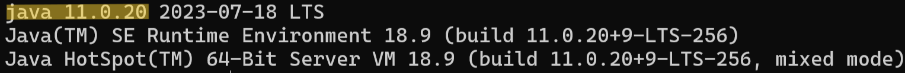
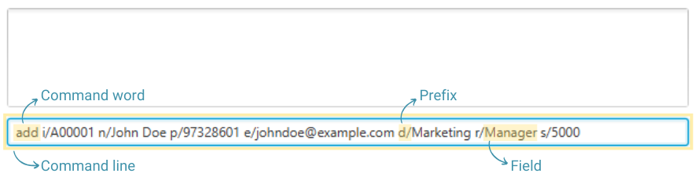
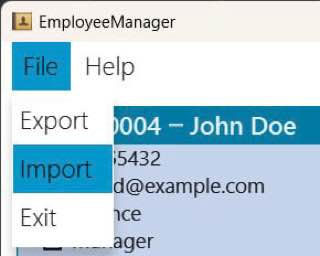
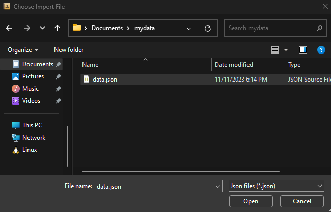
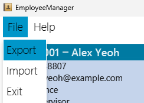
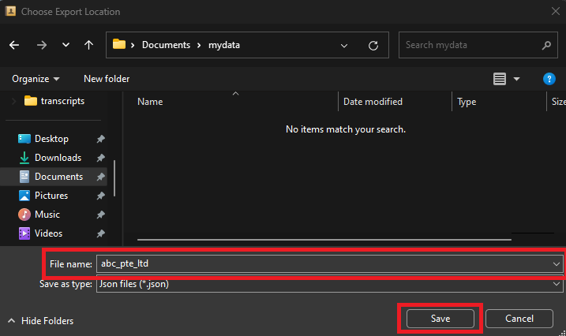

Welcome to **EmployeeManager**! Do you need to manage employees? Are you having trouble using spreadsheets? Or does your
organisation not have a proper employee management system? EmployeeManager is the application for you!

EmployeeManager is a **desktop application** for **Human Resources (HR) staff** to **manage employees in a small or medium-sized enterprise (SME)**.

Here’s an **overview** of EmployeeManager’s features:
* Consolidate and manage employee details in a single application 
* Conveniently view, add, or delete employee details
* Easily increment salary or delete many employees at once

EmployeeManager is **optimised for use via a Command Line Interface** (CLI) while still having the benefits of a
Graphical User Interface (GUI). If you can type fast, EmployeeManager can get your employee management tasks done more
quickly than traditional GUI apps, so HR staff can be more efficient.

This User Guide aims to help both new and experienced users use EmployeeManager. Learn to leverage the features of 
EmployeeManager to make managing employees easier!

If you are a **new user**:
* Get started with EmployeeManager by going through [Quick start](#quick-start)
* If you have no prior experience with CLI or require a refresher, refer to this [guide](#how-to-use-command-line-interface)

If you are an **experienced user**:
* Refer to the [Table of contents](#table-of-contents) to jump to the section that you are looking for

--------------------------------------------------------------------------------------------------------------------
## Table of contents

* Table of Contents
{:toc}

--------------------------------------------------------------------------------------------------------------------

## Quick start

1. Ensure you have Java `11` or above installed on your Computer.
   1. Open the **terminal** on your Computer.
      1. **Windows**: Open Windows Search and search for "terminal".
      1. **Mac**: Open Spotlight Search and search for "terminal".
      1. **Linux**: Press `Ctrl + Alt + T`.
   1. Type `java --version` into the terminal.
   1. If you have java installed, it should look similar to this:  
      
   1. Check that your version starts with `11` or higher.
   1. If you do not have Java `11` or above installed, you can download Java `11` [here](https://www.oracle.com/java/technologies/downloads/#java11).

1. Download the latest `employeemanager.jar` from [here](https://github.com/AY2324S1-CS2103T-T14-1/tp/releases).

1. Copy the file to the folder you want to use as the _home folder_ for your EmployeeManager.

1. Open a command terminal, type the `cd FOLDER` command, substituting `FOLDER` with the folder path of the folder you put the jar file in. 
   _The `cd` command changes the working directory of the terminal, allowing EmployeeManager to be launched in the next step._

1. Type the `java -jar employeemanager.jar` command to run the application. 
   A GUI similar to the below should appear in a few seconds. Note how the app contains some sample data. 
   

1. Type the command in the command box and press Enter to execute it. e.g. typing `help` and pressing Enter will open the help window. 
   Some example commands you can try:

   * `list` : Lists all employees.

   * `add i/A00001 n/John Doe p/97328601 e/johndoe@example.com d/Marketing r/Manager s/5000` : Adds an employee named `John Doe` to EmployeeManager.

   * `delete 2` : Deletes the 2nd contact shown in the current list.

   * `exit` : Exits the app.

1. Refer to the [Features](#features) below for details of each command.

--------------------------------------------------------------------------------------------------------------------

## How to use command line interface

1. Click on the command box.

1. Type the command word.
   1. Example: `add` is the command word for adding an employee.

1. Follow the command format of the command and type the prefixes and/or fields required.
   1. Refer to the [Features](#features) for the details on the command format for each command.
   1. Example: `i/A00001 n/John Doe p/97328601 e/johndoe@example.com d/Marketing r/Manager s/5000`.

1. Press enter to execute the command.
   1. `add i/A00001 n/John Doe p/97328601 e/johndoe@example.com d/Marketing r/Manager s/5000` is executed to add an employee named `John Doe`.

--------------------------------------------------------------------------------------------------------------------

## Prefix Summary

The prefixes are commonly used in commands such as `add`, `edit`, `find`, `sort` etc.
The table below provides a summary on the corresponding prefix for each Employee's attribute.
The constraint for the attribute is also listed in the table.

| Prefix | Attribute   | Constraint                                                   |
|--------|-------------|--------------------------------------------------------------|
| `d/`   | Department  | Alphanumeric characters and whitespaces only                 |
| `e/`   | Email       | Valid email address format                                   |
| `i/`   | Employee ID | Alphanumeric characters only                                 |
| `n/`   | Name        | Alphanumeric characters and whitespaces only                 |
| `p/`   | Phone       | Numerical with at least 3 digits                             |
| `r/`   | Role        | Alphanumeric characters and whitespaces only                 |
| `s/`   | Salary      | Numerical value up to 2 decimal point, and up to one billion |

--------------------------------------------------------------------------------------------------------------------

## Features

**:information_source: Notes about the command format:** 

* Words in `UPPER_CASE` are the parameters to be supplied by the user. 
  e.g. in `add n/NAME`, `NAME` is a parameter which can be used as `add n/John Doe`.

* Items in square brackets are optional. 
  e.g `find [i/ID] [n/NAME] [p/PHONE] [e/EMAIL] [d/DEPARTMENT] [r/ROLE] [s/SALARY_LOWER_BOUND - SALARY_UPPER_BOUND]` can be used as `find n/John Doe` or as `find n/John Doe d/finance`.

* Parameters can be in any order. 
  e.g. if the command specifies `n/NAME p/PHONE_NUMBER`, `p/PHONE_NUMBER n/NAME` is also acceptable.

* Extraneous parameters for commands that do not take in parameters (such as `help`, `list`, `exit` and `clear`) will be ignored. 
  e.g. if the command specifies `help 123`, it will be interpreted as `help`.

* If you are using a PDF version of this document, be careful when copying and pasting commands that span multiple lines as space characters surrounding line-breaks may be omitted when copied over to the application.

### Viewing help : `help`

Shows a message explaining how to access the help page.

Format: `help`

### Adding an employee: `add`

Adds an employee to EmployeeManager.

Format: `add i/ID n/NAME p/PHONE e/EMAIL d/DEPARTMENT r/ROLE s/SALARY`

Examples:
* `add i/A00001 n/John Doe p/97328601 e/johndoe@example.com d/Marketing r/Manager s/5000` Adds an employee `John Doe` into the list.
* `add i/A00002 n/Betsy Crowe p/82517642 e/betsycrowe@example.com d/Finance r/Intern s/1200.11` Adds an employee `Betsy Crowe` into the list.

### Listing all employees : `list`

Shows a list of all employees in EmployeeManager.

Format: `list`

### Editing an employee : `edit`

Edits an existing employee in EmployeeManager.

Format: `edit INDEX [i/ID] [n/NAME] [p/PHONE] [e/EMAIL] [d/DEPARTMENT] [r/ROLE] [s/SALARY]`

* Edits the employee at the specified `INDEX`. The index refers to the index number shown in the displayed employee list. The index **must be a positive integer** 1, 2, 3, …​
* At least one of the optional fields must be provided.
* Existing values will be updated to the input values.

Examples:
*  `edit 1 p/91234567 e/johndoe@example.com` Edits the phone number and email address of the 1st employee to be `91234567` and `johndoe@example.com` respectively.
*  `edit 2 n/Betsy Crower` Edits the name of the 2nd person to be `Betsy Crower`.

### Finding an employee by multiple attributes: `find`

Finds the employees that satisfy the find requirements based on multiple attributes.

Format: `find [i/KEYWORD] [n/KEYWORD [OTHER KEYWORD]] [p/KEYWORD] [e/KEYWORD [OTHER KEYWORD]] [d/KEYWORD [OTHER KEYWORD]] [r/KEYWORD [OTHER KEYWORD]] [s/LOWERBOUND - UPPERBOUND]`

* Find command must be used with **at least one prefix** and the keyword for the prefix **must not be empty**.
* Find command for all attributes are **case-insensitive**. 
* Finds employees whose attributes satisfy all the search parameters.

Examples:
* `find i/A00 n/alex p/9001` returns employees whose ID contains `A00`, name contains the word `alex` and phone number contains `9001`.

#### Finding an employee by name: `find n/`

Find employees whose name matches at least one of the keywords in full.

Format: `find n/KEYWORD [OTHER KEYWORD]`

* The order of the keywords does not matter.
* Only **full keywords** will be matched.
* Employees whose name **matches at least one keyword** will be returned.

Examples:
* `find n/John` return employees with names `john` and `John Doe`.
* `find n/alex david` returns employees with names `Alex Yeoh`, `David Li`.

#### Finding an employee by department: `find d/`

Find employees whose department matches at least one of the keywords in full.

Format: `find d/KEYWORD [OTHER KEYWORD]`

* Works the same as finding an employee by name.

#### Finding an employee by role: `find r/`

Find employees whose role matches at least one of the keywords in full.

Format: `find r/KEYWORD [OTHER KEYWORD]`

* Works the same as finding an employee by name.

#### Finding an employee by email: `find e/`

Find employees whose email contains at least one of the keywords.

Format: `find e/KEYWORD [OTHER KEYWORD]`

* The order of the keywords does not matter.
* Email will be matched if it **contains a keyword**.
* Email **containing at least one keyword** will be returned.

Examples:
* `find e/alex bernice` returns employees with emails `alexyeoh@example.com`, `bernicetan@example.com`.

#### Finding an employee by ID: `find i/`

Finds employees whose ID contains the keyword.

Format: `find i/KEYWORD`

* The command will find employees whose ID contains the keyword.

Examples:
* `find i/A00` returns employees with IDs `A00`, `A00001` and `a0001`.

#### Finding an employee by phone number: `find p/`

Find employees whose phone number contains the keyword.

Format: `find p/KEYWORD`

* Works the same as finding an employee by ID.

#### Finding an employee by salary: `find s/`

Finds employees whose salaries fall within the range of LOWERBOUND to UPPERBOUND inclusive of LOWERBOUND and UPPERBOUND.

Format: `find s/LOWERBOUND - UPPERBOUND`

* The LOWERBOUND **cannot be larger than** the UPPERBOUND.
* There must be a **spacing before and after the dash**
* LOWERBOUND and UPPERBOUND must be **non-negative integers** and **cannot be larger than 1 000 000 000**.

Examples:
* `find s/1000 - 5000` returns employees with salaries `1000.00`, `4321.10`, `5000.00`.

### Deleting an employee : `delete`

Deletes the specified employee from EmployeeManager.

Format: `delete INDEX`

* Deletes the employee at the specified `INDEX`.
* The index refers to the index number shown in the displayed employee list.
* The index **must be a positive integer** 1, 2, 3, …​

Examples:
* `list` followed by `delete 2` deletes the 2nd person in EmployeeManager.
* `find n/Betsy` followed by `delete 1` deletes the 1st person in the results of the `find` command.

### Sorting displayed employees : `sort`

Sorts the displayed list based on the specified employee's attribute in _ascending_ order.

Format: `sort [i/] [d/] [e/] [s/] [r/] [n/] [p/]`

* The prefix specifies the attribute to be sorted with.
* Exactly one of the prefix must be specified.
* Refer to the [Prefix Summary](#prefix-summary) for help on the mapping of the attribute and prefix
* Attributes are sorted by lexicographical order. For example, "Alice" comes before "Bob", 
and "100" comes before "200".

Examples:
* `sort i/` sorts the list by ID.
* `sort d/` sorts the list by department.
* `sort e/` sorts the list by email.
* `sort s/` sorts the list by salary.
* `sort r/` sorts the list by role.
* `sort n/` sorts the list by name.
* `sort p/` sorts the list by phone.

### Incrementing multiple employees' salaries: `increment`

  Increments the salaries of all employees in the displayed list in EmployeeManager by the given increment.

  Format: `increment INCREMENT`
* Increments the salaries of all employees in the displayed list by `INCREMENT`.
* `INCREMENT` can be positive or negative.
* `INCREMENT` is invalid if `INCREMENT` causes the salary of any employee in the displayed list to fall below 0 or exceed the maximum salary.
* `INCREMENT` can have at most 2 decimals.

  Examples:
* `increment 1000` increments the salaries of all employees in the displayed list by `1000`.
* `increment -100.65` decrements the salaries of all employees in the displayed list by `100.65`.

### Undoing a modification : `undo`

  Restores EmployeeManager to the state before the last command that made a modification to the data in EmployeeManager.
  Such commands include `add`, `delete`, `edit`, `clear` and `increment`.

  Format: `undo`

  Examples:
* `clear` followed by `undo` restores EmployeeManager to the state before `clear` was executed.
* `delete 3` followed by `sort n/` followed by `undo` restores EmployeeManager to the state before `delete 3` was executed.

### Redoing the previous undone command : `redo`

Restores EmployeeManager to the state before the last `undo` as long as no command that made a modification to the data in EmployeeManager was executed since the last `undo`.
Commands that change the data in EmployeeManager include `add`, `delete`, `edit`, `clear` and `increment`.

Format: `redo`

Examples:
* `clear` followed by `undo`, followed by adding `John` and then `redo` will show `No more commands to redo!`.
* `delete 3` followed by `undo` followed by `find n/alex`, then `redo` restores EmployeeManager to the state after `delete 3` was executed.

### Clearing multiple employees' data : `clear`

Clears the current displayed list of entries from EmployeeManager.

Format: `clear`

### Importing data : `import`

Imports an EmployeeManager data file into the application.

* The data file must be of '.json' file type.
* The file path must be valid, and the application must have permission to read from the file.
* No changes will be made if the data file is invalid or not found.

:exclamation: **Danger:**
The import command will **overwrite** existing data in the application. If you wish to keep a copy of the existing
data, it is recommended to use the `export` command to save a copy of the current data.

Format: `import FILE_PATH`

Examples:
* `import ./persons.json` imports the "persons.json" data file.

#### GUI Option
Alternatively, you may use the GUI option to import the data file. 
1. Click File > Import in the top left corner of the application.

2. The file explorer will open and prompt you to select the data file. _The file explorer will look
look different depending on your operating system._

3. After selecting your data file, EmployeeManager will attempt to load the data into the application.

* The file explorer will only allow you to select .json files as that is the format of the data file.

### Exporting data : `export`

Exports the data file in EmployeeManager to the specified path.

* The file path must be valid, and the application must have permission to write to the directory.

Format: `export FILE_PATH`

Examples:
* `export ./data.json` will create the data file under the specified path.

:exclamation: **Danger:**
The export command will **overwrite** any file in the specified location.

#### GUI Option
Alternatively, you may use the GUI option to export the data file.
1. Click File > Export in the top left corner of the application.
   
2. The file explorer will open and prompt you to save the data file. _The file explorer will look
different depending on your operating system._
   
3. After selecting your save location, EmployeeManager will attempt to save the data into the specified location.

* The file explorer will save the file as a .json file format.
* The data file can be given any _valid name_, e.g. `abc_pte_ltd.json` as shown in the image above.
* Valid file name is dependent on the operating system.

### Viewing command history : `history`

Displays up to the last `N` valid user commands that have been executed, starting from the previous command. 
If the number of valid user commands is less than `N`, it shows all valid user commands that have been executed.

Format: `history N`
* N specifies the number of most recent valid commands to be displayed, not inclusive of the current `history` command.
* N must be a positive integer.

Examples:
* `history 5` displays up to the last 5 valid user commands.
* `history 1` displays the most recent valid user command.
* `history 10` displays up to the last 10 valid user commands. 
If fewer than 10 commands have been executed, all available commands are shown.

### Exiting the program : `exit`

Exits the program.

Format: `exit`

### Saving the data

EmployeeManager data are saved in the hard disk automatically after any command that changes the data. There is no need to save manually.

### Editing the data file

EmployeeManager data are saved automatically as a JSON file `[JAR file location]/data/employeemanager.json`. Advanced users are welcome to update data directly by editing that data file.

:exclamation: **Caution:**
If your changes to the data file makes its format invalid, EmployeeManager will discard all data and start with an empty data file at the next run. Hence, it is recommended to take a backup of the file before editing it.

### Archiving data files `[coming in v2.0]`

_Details coming soon ..._

--------------------------------------------------------------------------------------------------------------------

## FAQ

**Q1**: How do I transfer my data to another Computer? 
**A**: Install the app in the other computer and overwrite the empty data file it creates with the file that contains the data of your previous EmployeeManager home folder.

**Q2**: Are the employees listed in the order of id or name? 
**A**: No, the employees are not listed in any explicit order. Newly added employees will be placed at the end of the list.

**Q3**: Can I simply update certain details of an employee without deleting the old information? 
**A**: You can only delete and add the updated employee information again so far, the new `update` feature is coming soon!

--------------------------------------------------------------------------------------------------------------------

## Known issues

1. **When using multiple screens**, if you move the application to a secondary screen, and later switch to using only the primary screen, the GUI will open off-screen. The remedy is to delete the `preferences.json` file created by the application before running the application again.

--------------------------------------------------------------------------------------------------------------------

## Command summary

| Action        | Format, Examples                                                                                                                                                                                                                                    |
|---------------|-----------------------------------------------------------------------------------------------------------------------------------------------------------------------------------------------------------------------------------------------------|
| **Add**       | `add i/ID n/NAME p/PHONE e/EMAIL d/DEPARTMENT r/ROLE s/SALARY`   e.g.,`add i/A00001 n/John Doe p/97328601 e/johndoe@example.com d/Marketing r/Manager s/5000`                                                                                    |
| **Clear**     | `clear`                                                                                                                                                                                                                                             |
| **Delete**    | `delete INDEX`  e.g., `delete 2`                                                                                                                                                                                                                 |
| **Edit**      | `edit INDEX [i/ID] [n/NAME] [p/PHONE] [e/EMAIL] [d/DEPARTMENT] [r/ROLE] [s/SALARY]`  e.g., `edit 1 p/91234567 e/johndoe@example.com`, `edit 2 n/Betsy Crower`                                                                                    |
| **Exit**      | `exit`                                                                                                                                                                                                                                              |
| **Export**    | `export FILE_PATH`  e.g., `export C:\Users\user\Downloads\EmployeeList.csv`                                                                                                                                                                      |
| **Find**      | `find [i/KEYWORD] [n/KEYWORD [OTHER KEYWORD]] [p/KEYWORD] [e/KEYWORD [OTHER KEYWORD]] [d/KEYWORD [OTHER KEYWORD]] [r/KEYWORD [OTHER KEYWORD]] [s/LOWERBOUND - UPPERBOUND]`  e.g., `find n/John`, `find i/A00 p/9001`, `find r/executive manager` |
| **History**   | `history N`  e.g., `history 2`                                                                                                                                                                                                                   |
| **Increment** | `increment INCREMENT`  e.g., `increment 1000`, `increment -100.65`                                                                                                                                                                               |
| **Import**    | `import FILE_PATH`  e.g., `import C:\Users\user\Downloads\EmployeeList.csv`                                                                                                                                                                      |
| **List**      | `list`                                                                                                                                                                                                                                              |
| **Redo**      | `redo`                                                                                                                                                                                                                                              |
| **Sort**      | `sort [i/] [d/] [e/] [s/] [r/] [n/] [p/]`  e.g., `sort i/`, `sort n/`, `sort p/`                                                                                                                                                                 |
| **Undo**      | `undo`                                                                                                                                                                                                                                              |

--------------------------------------------------------------------------------------------------------------------

## Glossary Table

| Term          | Description                                                                                                                                                                                                                                         |
|---------------|-----------------------------------------------------------------------------------------------------------------------------------------------------------------------------------------------------------------------------------------------------|
| **CLI**       | Stands for Command Line Interface and it is a means of interacting with a computer program by inputting lines of text called command-lines.                                                                                                         |
| **GUI**       | Stands for Graphical User Interface and it uses icons, menus and a mouse (to click on the icon or pull down the menus) to manage interaction with the system.                                                                                       |

