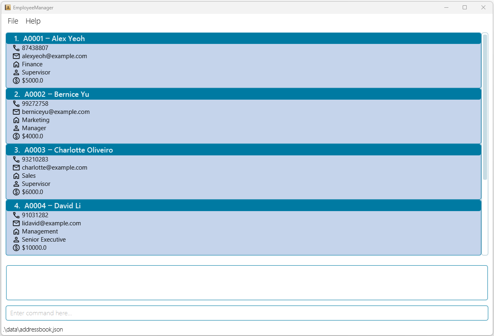
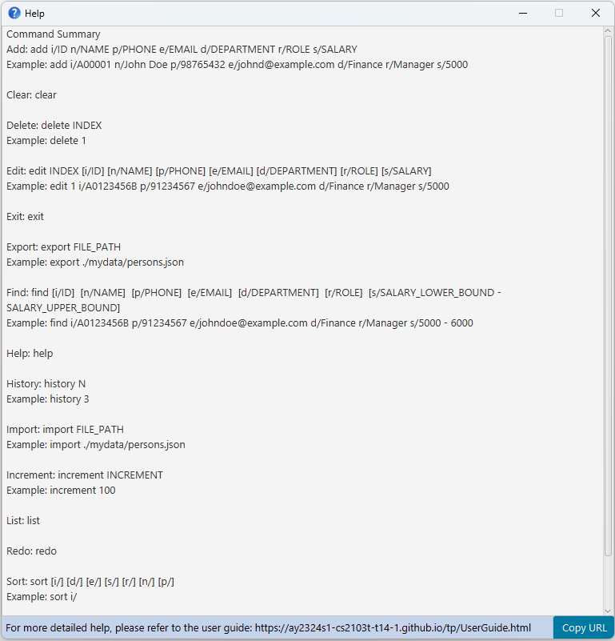

Welcome to **EmployeeManager**! Do you need to manage employees? Are you having trouble using spreadsheets? Or does your
organisation not have a proper employee management system? EmployeeManager is the application for you!

EmployeeManager is a **desktop application** for **Human Resources (HR) staff** to **manage employees in a relatively
large organisation (about 50 - 200 employees)**.

Here’s an **overview** of EmployeeManager’s features:
* Consolidate and manage employee details in a single application 
* Conveniently view, add, or delete employee details

EmployeeManager is **optimised for use via a Command Line Interface** (CLI) while still having the benefits of a
Graphical User Interface (GUI). If you can type fast, EmployeeManager can get your employee management tasks done more
quickly than traditional GUI apps, so HR staff can be more efficient.

This User Guide aims to help both new and experienced users use EmployeeManager. Learn to leverage the features of 
EmployeeManager to make managing employees easier!

If you are a **new user**:
* Get started with EmployeeManager by going through [Quick start](#quick-start) and [Navigating the user guide](#navigating-the-user-guide)
* If you have no prior experience with CLI or require a refresher, refer to this guide *(coming soon)*

If you are an **experienced user**:
* Refer to the [Table of contents](#table-of-contents) to jump to the section that you are looking for

--------------------------------------------------------------------------------------------------------------------

## Table of contents
{:toc}

--------------------------------------------------------------------------------------------------------------------

## Navigating the user guide
*Coming soon*

--------------------------------------------------------------------------------------------------------------------

## Quick start

1. Ensure you have Java `11` or above installed on your Computer.

1. Download the latest `employeemanager.jar` from [here](https://github.com/AY2324S1-CS2103T-T14-1/tp/releases).

1. Copy the file to the folder you want to use as the _home folder_ for your EmployeeManager.

1. Open a command terminal, `cd` into the folder you put the jar file in, and use the `java -jar employeemanager.jar` command to run the application. 
   A GUI similar to the below should appear in a few seconds. Note how the app contains some sample data. 
   

1. Type the command in the command box and press Enter to execute it. e.g. typing **`help`** and pressing Enter will open the help window. 
   Some example commands you can try:

   * `list` : Lists all employees.

   * `add id/A035B name/John Doe position/Supervisor department/Marketing salary/5000` : Adds a contact named `John Doe` to EmployeeManager.

   * `delete id/A035B` : Deletes the employee with id `A035B`.

   * `exit` : Exits the app.

1. Refer to the [Features](#features) below for details of each command.

--------------------------------------------------------------------------------------------------------------------

## Features

**:information_source: Notes about the command format:** 

* Words in `UPPER_CASE` are the parameters to be supplied by the user. 
  e.g. in `add n/NAME`, `NAME` is a parameter which can be used as `add n/John Doe`.

* Items in square brackets are optional. 
  e.g `n/NAME [t/TAG]` can be used as `n/John Doe t/friend` or as `n/John Doe`.

* Items with `…`​ after them can be used multiple times including zero times. 
  e.g. `[t/TAG]…​` can be used as ` ` (i.e. 0 times), `t/friend`, `t/friend t/family` etc.

* Parameters can be in any order. 
  e.g. if the command specifies `n/NAME p/PHONE_NUMBER`, `p/PHONE_NUMBER n/NAME` is also acceptable.

* Extraneous parameters for commands that do not take in parameters (such as `help`, `list`, `exit` and `clear`) will be ignored. 
  e.g. if the command specifies `help 123`, it will be interpreted as `help`.

* If you are using a PDF version of this document, be careful when copying and pasting commands that span multiple lines as space characters surrounding line-breaks may be omitted when copied over to the application.

### Viewing help : `help`

Shows a message explaning how to access the help page.

Format: `help`

### Adding an employee: `add`

Adds employees into the EmployeeManager application. 
Employee ID can either be specified or not. If specified, the application will check the existing list of employees 
to check whether the entered ID is unique. If not unique it will show an error. If no Employer ID is specified then the 
application will automatically assign a unique ID to the employee.

Format: `add [id/EMPLOYEE_ID] name/NAME position/POSITION department/DEPARTMENT salary/SALARY`

Examples:
* `add id/A035B name/Richard Hew Jia Liang position/Supervisor department/Marketing salary/5000`
* `add name/Richard Hew Jia Liang position/Supervisor department/Marketing salary/5000`

Constraints:
* Employee ID must be unique if specified and up to 10 characters
* Salary must be numerical and >= 0
* Name, Position, and Department up to 100 characters each

Expected output when employee added successfully:
* `Employee EMPLOYEE_ID NAME successfully added!`

Expected output when add command fails:
* Invalid Salary : `Please input a non-negative salary as a numerical value (e.g. 4000)`
* Duplicate employee ID : `EMPLOYEE_ID already exists`
* Unable to assign employee ID : `There is no employee ID available to be assigned. Please delete unused employees 
to free up employee IDs`
* Too long name/position/department : `Please keep the <NAME/POSITION/DEPARTMENT up to 100 characters.`
* Missing inputs : `<Inputs that are missing> are missing from the command. Please input the add command in the format:
add [id/EMPLOYEE_ID] name/NAME position/POSITION department/DEPARTMENT salary/SALARY`

### Listing a list of employees : `list`

* Shows a list of all persons in the address book.
* Command Format: `list`
* Examples:`list`
* Expected outputs when the command succeeds:  
`1. A1234 John Supervisor Accounting 10000`  
`2. A1235 Mary Supervisor Finance 10000`
* Expected outputs when the command fails:  
`Error with displaying the list of employees.`

### Editing a person : `edit`

Edits an existing person in the address book.

Format: `edit INDEX [n/NAME] [p/PHONE] [e/EMAIL] [a/ADDRESS] [t/TAG]…​`

* Edits the person at the specified `INDEX`. The index refers to the index number shown in the displayed person list. The index **must be a positive integer** 1, 2, 3, …​
* At least one of the optional fields must be provided.
* Existing values will be updated to the input values.
* When editing tags, the existing tags of the person will be removed i.e adding of tags is not cumulative.
* You can remove all the person’s tags by typing `t/` without
    specifying any tags after it.

Examples:
*  `edit 1 p/91234567 e/johndoe@example.com` Edits the phone number and email address of the 1st person to be `91234567` and `johndoe@example.com` respectively.
*  `edit 2 n/Betsy Crower t/` Edits the name of the 2nd person to be `Betsy Crower` and clears all existing tags.

### Locating persons by name: `find`

Finds persons whose names contain any of the given keywords.

Format: `find KEYWORD [MORE_KEYWORDS]`

* The search is case-insensitive. e.g `hans` will match `Hans`
* The order of the keywords does not matter. e.g. `Hans Bo` will match `Bo Hans`
* Only the name is searched.
* Only full words will be matched e.g. `Han` will not match `Hans`
* Persons matching at least one keyword will be returned (i.e. `OR` search).
  e.g. `Hans Bo` will return `Hans Gruber`, `Bo Yang`

Examples:
* `find John` returns `john` and `John Doe`
* `find alex david` returns `Alex Yeoh`, `David Li` 
  

### Deleting an employee : `delete`

Deletes the specified employee from the employee book.

Format: `delete id/EMPLOYEE_ID`

* Deletes the employee with the specified `EMPLOYEE_ID`.
* The `EMPLOYEE_ID` should be the ID of an employee that exists in the employee book.
* If the `EMPLOYEE_ID` specified does not match any employee in the employee book, 
no employee will be deleted or modified.

Examples:
* `delete id/A1234567B` deletes the employee with the ID `A1234567B` if such employee exists.

### Clearing all entries : `clear`

Clears all entries from the address book.

Format: `clear`

### Exiting the program : `exit`

Exits the program.

Format: `exit`

### Saving the data

AddressBook data are saved in the hard disk automatically after any command that changes the data. There is no need to save manually.

### Editing the data file

AddressBook data are saved automatically as a JSON file `[JAR file location]/data/addressbook.json`. Advanced users are welcome to update data directly by editing that data file.

:exclamation: **Caution:**
If your changes to the data file makes its format invalid, AddressBook will discard all data and start with an empty data file at the next run. Hence, it is recommended to take a backup of the file before editing it.

### Archiving data files `[coming in v2.0]`

_Details coming soon ..._

--------------------------------------------------------------------------------------------------------------------

## FAQ

**Q1**: How do I transfer my data to another Computer? 
**A**: Install the app in the other computer and overwrite the empty data file it creates with the file that contains the data of your previous AddressBook home folder.

**Q2**: Are the employees listed in the order of id or name? 
**A**: No, the new added employees will be placed from the end of the list.

**Q3**: Can I simply update certain details of an employee without deleting the old information? 
**A**: You can only delete and add the updated employee information again so far, the new `update` feature is coming soon!

--------------------------------------------------------------------------------------------------------------------

## Known issues

1. **When using multiple screens**, if you move the application to a secondary screen, and later switch to using only the primary screen, the GUI will open off-screen. The remedy is to delete the `preferences.json` file created by the application before running the application again.

--------------------------------------------------------------------------------------------------------------------

## Command summary

| Action     | Format, Examples                                                                                                                                                                                                                                                                    |
|------------|-------------------------------------------------------------------------------------------------------------------------------------------------------------------------------------------------------------------------------------------------------------------------------------|
| **Add**    | `add [id/EMPLOYEE_ID] name/NAME position/POSITION department/DEPARTMENT salary/SALARY`   e.g., `add id/A035B name/Richard Hew Jia Liang position/Supervisor department/Marketing salary/5000`, `name/Richard Hew Jia Liang position/Supervisor department/Marketing salary/5000` |
| **Delete** | `delete id/EMPLOYEE_ID`  e.g., `delete id/A1234567B`                                                                                                                                                                                                                             |
| **List**   | `list`                                                                                                                                                                                                                                                                              |
